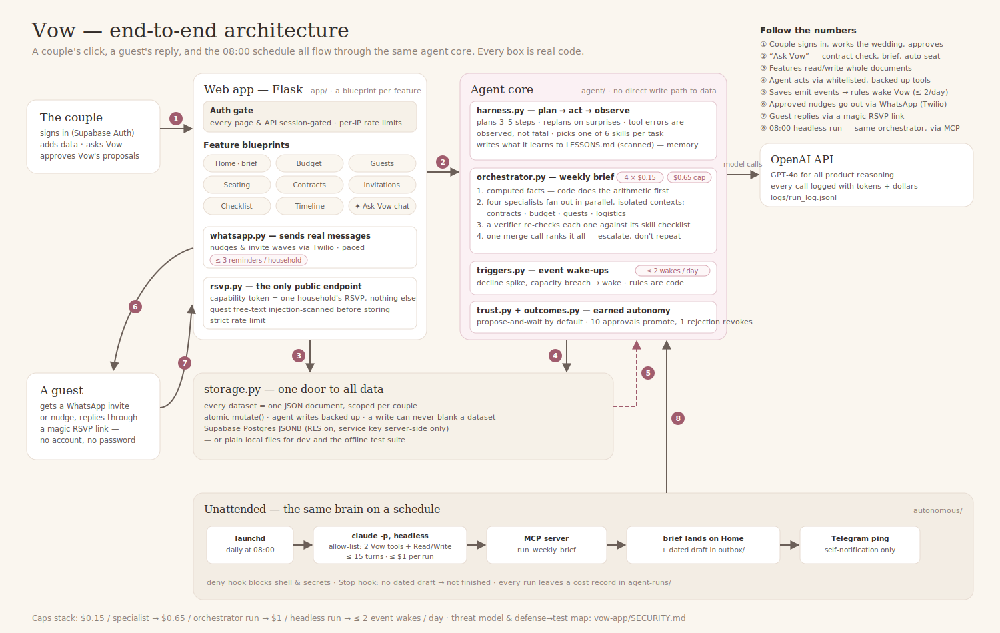

# Vow — an AI agent that plans weddings

[](https://github.com/talsolovey/WeddingOS/actions/workflows/tests.yml)

Vow watches a couple's whole wedding — contracts, budget, guest list, seating,
invitations — and *investigates, judges, and escalates* instead of running a
script. It reads vendor contracts for red flags, projects the real headcount,
notices when RSVPs stop converging, sends the WhatsApp nudges itself, and
compiles it all into a weekly brief produced by a team of specialist sub-agents
that a verifier double-checks.

**Live demo:** <https://weddingplanner-q4rw.onrender.com> — sign in as
email `demo@vow-demo.app`, password `enjoy-being-engaged` (a seeded sample wedding; click
"✦ Refresh" on Home to watch the orchestrator + verifier run live) ·
**Full build log:** [PROJECT_STATE.md](PROJECT_STATE.md) ·
**Threat model:** [vow-app/SECURITY.md](vow-app/SECURITY.md)



## The agentic core

- **Four specialist sub-agents** (contracts / budget / guests / logistics) fan
  out in parallel, each with a fresh context, one skill, and a $0.15 cap. A
  tool-free **verifier** re-checks each against its skill checklist — in its
  first live run it caught **5 items the specialists missed**. One merge call
  ranks everything into the brief.
- **Arithmetic is code, not model.** Sums, overruns, overdue balances, table
  loads and `weeks_to_wedding` are computed deterministically and injected as
  trusted facts — because our own evals proved the model can't reliably sum
  seven line items.
- **Skills + lessons loop.** The agent reads instruction files to know *how*
  to do a job and appends lessons it learns for future runs (scanned for
  injection before they become memory).
- **Scheduled autonomy.** A launchd job runs the brief headless daily through
  an MCP server — tool allow-list, deny hooks, a Stop hook that refuses to
  finish without a draft, `--max-budget-usd` stacked on the orchestrator's own
  cap, and a Telegram push of the result.
- **Event-driven wake-ups.** Data writes are observed; bursts are debounced
  and significant changes wake the orchestrator (hard-capped per day) or leave
  a notice.
- **The agent proposes, code disposes.** Seating plans, data writes, wave
  sends — deterministic validation gates every consequential action; the
  model holds no messaging tool and no credentials.

## Evidence — verify every claim yourself

| Claim | How to verify |
|---|---|
| 193 offline tests, zero network, all fakes at named seams | `cd vow-app && python -m unittest discover -s tests` (also runs in CI on every push) |
| Skills are *measured*, not vibes: planted-trap evals with recall/noise/cost | `python -m evals.run_evals --dry-run` (structure) or `python -m evals.run_evals` (live, ~$0.09); archived scores in `vow-app/evals/results/` |
| Eval-driven iteration worked: budget 2/6 → 4/6, guests 3/5 → 5/5 | before/after result files in `vow-app/evals/results/`; skill diffs in git history (`git log --oneline -- vow-app/skills`) |
| The unattended stack is wired and guarded | `./autonomous/smoke-test.sh` — 24 checks, $0, no model call |
| Deny/Stop hooks actually fire | `autonomous/agent-runs/blocked.log` + the force-continue exercise in PROJECT_STATE Step 19 |
| Every agent dollar is logged | `vow-app/logs/run_log.jsonl` — per-call tokens, cost, tools, orchestration id |
| Injection defenses hold (PDFs, guest text, names, lessons, chat) | `python -m unittest tests.test_defenses tests.test_injection_gaps`; defense→test map in SECURITY.md |
| Couples can't see each other's data | `python -m unittest tests.test_auth` (gate, isolation, OAuth token verification) |
| Brief quality is judged, not assumed | `python3 autonomous/judge.py --dry-run` — LLM-judge + 8-case golden set incl. a prompt-injection pair |
| Concurrency is safe (paced jobs vs live edits) | `python -m unittest tests.test_robustness` — delivery-vs-edit race proven harmless |

What the agent did on its own along the way — surprises, failures, fixes — is
logged honestly in [AGENT_MOMENTS.md](AGENT_MOMENTS.md).

## Run it

```bash
cd vow-app
python3 -m venv venv && source venv/bin/activate
pip install -r requirements.txt
# .env: OPENAI_API_KEY=...  (optional: SUPABASE_URL/KEYS, TWILIO_*, VOW_SECRET_KEY)
python server.py            # http://localhost:5050
```

No Supabase credentials → local JSON files. No Twilio → WhatsApp degrades to
click-to-chat. The offline test suite needs no configuration at all.

## Repo map

```
vow-app/            the product: Flask app, agent/ (harness, orchestrator,
                    triggers, guard), skills/, evals/, tests/, SECURITY.md
autonomous/         the unattended kit: headless runner, hooks, launchd,
                    smoke test, LLM judge + golden set
PROJECT_STATE.md    every step, every decision, every honest residual
AGENT_MOMENTS.md    what the agent surprised us with (good and bad)
```

## Known limitations (kept on purpose, documented in place)

Single-process job/limiter state (documented in `app/core.py`), keyword-based
injection scanning with deterministic write-guards as the backstop, eval
recall varies ±1 between runs (read medians), and the Twilio sandbox requires
recipients to opt in — production needs a registered WhatsApp sender (the
provider seam for Meta's API is already implemented).

---

<details>
<summary>Week 1 archaeology: the same landing page built three ways</summary>

The repo began as a comparison of LLM autonomy levels — the same landing page
built three ways: with a raw model, a custom tool harness, and a full agent.
The harness built there became the brain this whole product runs on. (The
three pages were removed in the pre-submission cleanup; they live in git
history.)

</details>
